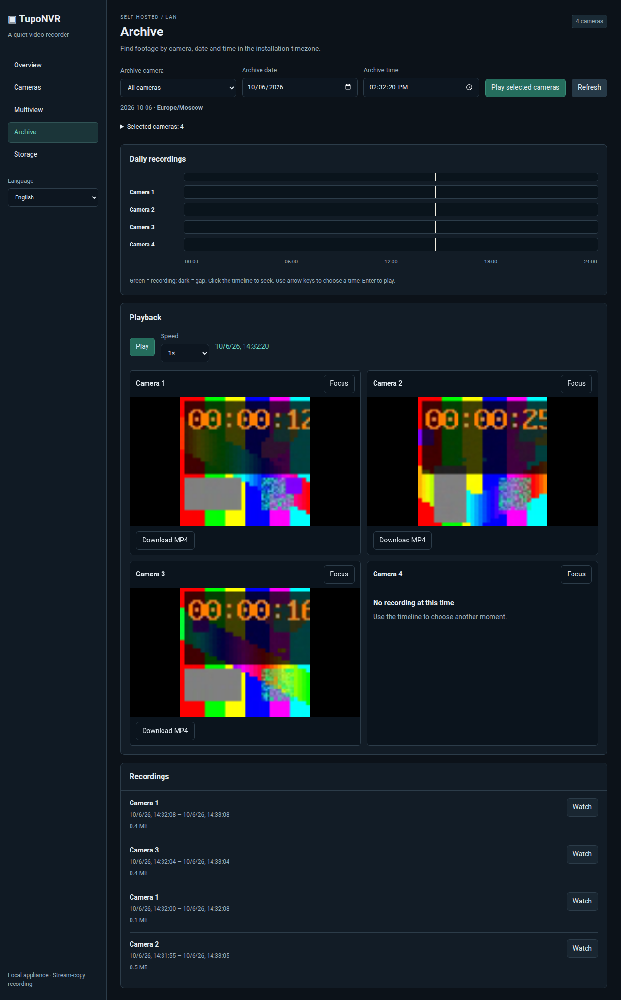
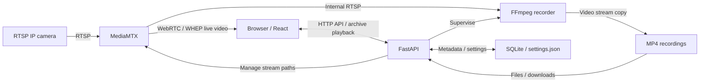

# TupoNVR

**A deliberately simple, self-hosted NVR for RTSP cameras.**

[Русская версия](README_RU.md) · [Operating guide (English)](docs/operations.md)

[](LICENSE)
[](docker-compose.yml)

Add cameras. Watch live video. Record footage. Browse the archive. Nothing unnecessary.

TupoNVR keeps IP camera recording manageable for a home, small CCTV installation, or homelab. Simplicity is a design decision, not a temporary limitation.



*Actual application screenshot from browser tests, using synthetic video. See [Screenshots and demo](#screenshots-and-demo).*

## Why TupoNVR?

Sometimes you just need an NVR that records your cameras and lets you find what happened. TupoNVR follows the Unix philosophy and KISS principle: a focused application, established tools, and a small deployment you can understand and maintain yourself.

One application container and one MediaMTX container handle recording, live view, and archive browsing. Recording continues when every browser tab is closed. Video is copied without server transcoding.

## Features

- Add, edit, enable, disable, and check RTSP cameras; see connectivity and recording health separately.
- Live view for individual cameras and saved Multiview layouts with draggable, resizable tiles and optional camera substreams.
- Original video recording into MP4 segments, configurable retention, and downloads.
- Browse one or several cameras on a shared archive timeline with play/pause, seek, speed controls, gaps, and independent segment transitions.
- Weekly recording schedules and an installation-wide timezone, including DST-aware archive selection.
- Per-destination storage checks and optional identity protection for missing external mounts.
- English/Russian interface, optional UI/API login, generic webhooks, and health/metrics endpoints.

## Quick Start

Use a Linux host with **Docker Engine and Docker Compose v2**, network access to the cameras, and writable storage sized for their bitrate. You do not need host Python, Node, or FFmpeg. Viewing requires a modern browser with WebRTC and compatible MP4 playback; use H.264 as the starting point.

1. Get the deployment files and create the configuration:

   ```sh
   git clone https://github.com/vvbelousov/TupoNVR.git
   cd TupoNVR
   cp .env.example .env
   ```

2. Edit `.env`: set `WEBRTC_HOST` to the host's LAN IP when viewing from another device. Set `DEFAULT_RECORDING_PATH` to your host recording directory, or keep `./recordings` for local storage. Mount external storage first. Set both `AUTH_USERNAME` and `AUTH_PASSWORD` if you want application login; both are empty by default.

3. Set the image in `.env`, choosing `0.1.0`, `latest`, or another published tag from [Docker Hub](https://hub.docker.com/r/vvbelousov/tuponvr/tags). Pin a version for predictable updates; `latest` follows the current stable release.

   ```dotenv
   NVR_IMAGE=vvbelousov/tuponvr:0.1.0
   ```

   Pull and start the containers:

   ```sh
   docker compose up -d --no-build --pull always
   ```

4. Open `http://<host-address>:8080`, go to **Cameras**, and add the camera's main RTSP URL and credentials. Cameras and recording are enabled by default; recording starts when storage is ready. Use **Check**, then verify recording progress in **Overview**. Configure your timezone in **Account → Preferences** before using schedules or local archive times.

For viewing on the host itself, `WEBRTC_HOST=127.0.0.1` is sufficient. Other devices need access to **TCP 8080/8889 and UDP 8189** on the host; adjust your LAN firewall. Optional login protects the UI, API, and archive files, **but not MediaMTX's direct live-view ports**. Restrict those ports to trusted clients. See [SECURITY.md](SECURITY.md).

The command pulls the selected image without building locally. See [image deployment and source builds](docs/operations.md#published-image-deployment) for alternatives.

## Screenshots and demo

The [archive screenshot above](docs/images/archive-synchronized.png) shows four selected cameras, a shared playback clock, and independent players; the fourth camera has no footage at the selected time. It demonstrates the interface, not real-camera network compatibility. No hosted demo or additional screenshots are included. You can try the application with synthetic cameras using the [contribution validation instructions](CONTRIBUTING.md#validation).

## Architecture



FastAPI, React assets, SQLite, and one FFmpeg recorder per active camera belong to the **application container**; MediaMTX is the **second service**. MediaMTX shares a main RTSP upstream between recording and viewers. Optional substreams use separate on-demand paths. Direct connectivity checks briefly open an additional RTSP session to the camera.

Run exactly one application worker to avoid duplicate recorders. See [component ownership](docs/architecture.md) and [recording internals](docs/operations.md#video-architecture).

## Configuration and storage

Copy [.env.example](.env.example) to `.env`; it contains all Compose settings. Apply environment changes with `docker compose up -d --no-build --pull always` when using a published image.

| Variable | Default in `.env.example` | Purpose |
|---|---|---|
| `NVR_PORT` | `8080` | Host application TCP port |
| `WEBRTC_PORT` | `8889` | Host WHEP signaling TCP port |
| `WEBRTC_UDP_PORT` | `8189` | WebRTC media UDP port |
| `WEBRTC_HOST` | `127.0.0.1` | Host address advertised to browsers for ICE |
| `DATA_DIR` | `./data` | Host directory mounted at `/data`: SQLite and timezone settings |
| `DEFAULT_RECORDING_PATH` | `./recordings` | Host directory mounted at `/recordings` |
| `SEGMENT_SECONDS` | `600` | Target segment length in seconds; boundaries depend on keyframes |
| `MIN_FREE_SPACE_GB` | `5` | Free-space reserve (GiB) on recording filesystems |
| `AUTH_USERNAME`, `AUTH_PASSWORD` | empty | Optional shared login; set both or neither |
| `COOKIE_SECURE` | `false` | Secure session cookie for HTTPS |
| `DEFAULT_LANGUAGE` | `en` | Initial interface language: `en` or `ru` |
| `APP_TIMEZONE` | `UTC` | Initial installation timezone; a UI-saved value takes precedence |
| `LOG_LEVEL` | `INFO` | Backend logging level |
| `NVR_UID`, `NVR_GID` | `0`, `0` | Application container identity; non-root needs writable host directories |
| `NVR_IMAGE` | `vvbelousov/tuponvr:0.1.0` | Published application image reference; blank uses `tuponvr:local` |
| `WEBHOOK_URL`, `WEBHOOK_TOKEN` | empty | Optional HTTP(S) endpoint and Bearer token |
| `WEBHOOK_DEBOUNCE_SECONDS` | `60` | Continuous failure duration before notification |
| `WEBHOOK_COOLDOWN_SECONDS` | `600` | Minimum interval between new incident notifications per subject |

Recordings contain **video only**, copied into roughly ten-minute MP4 segments. Filenames and metadata remain UTC; the interface and schedules use the installation timezone. Archive shows finalized segments after indexing, normally on a five-minute scan, and also after a clean recorder stop.

Storage settings also provide [manual recording cleanup](docs/recording-cleanup.md): preview and delete recordings by camera, period, or individual selection. Clearing everything requires typing `DELETE`; active recording directories are excluded.

Each camera records into a destination subdirectory such as `default`. Retention defaults to **7 days** and accepts 1–3650 days; blank means no age limit. Deleted-camera footage uses a seven-day age limit from the recording's start, not the deletion date. Under low space, cleanup removes the oldest eligible indexed files, protecting the current hour of active cameras. The free-space reserve cannot always be guaranteed, and unlimited retention still permits low-space deletion.

Mount NFS/SMB storage on the host and verify write access and visibility inside the container. Enable destination identity protection before recording to an external mount. Unavailable storage pauses its cameras' recording while other destinations and live view continue. See [storage protection](docs/operations.md#per-destination-storage-protection).

Preserve and back up the complete data directory, recordings, `.env`, and storage IDs before updates. Camera credentials are stored in plaintext in SQLite: protect data and backups. Read [update and recovery instructions](docs/operations.md#updating-backup-and-recovery), [container permissions](docs/operations.md#container-permissions), and [HTTPS/proxy configuration](docs/operations.md#configuration).

## Project philosophy

Simplicity means predictable behavior, visible failures, and a system you can maintain. TupoNVR uses established components for streaming, recording, and storage, keeps dependencies and services limited, and aims to do one job well: make camera footage available to watch and review. Features should improve that workflow without requiring unnecessary infrastructure.

## Non-goals

TupoNVR is not intended to grow into an enterprise video management system (VMS) with distributed infrastructure, complex organizational access policies, or a large surveillance automation platform. Practical improvements to recording, live view, archive browsing, and reliability fit the project; complexity for its own sake does not.

## Known limitations

- No audio recording, detection, PTZ, ONVIF discovery/control, multi-user management, or native mobile application is implemented.
- No transcoding: browser codec support determines live/archive playback. H.265 support varies; a camera being Online does not guarantee browser playback.
- Archive synchronization is practical rather than frame-accurate. Timestamp precision, camera latency, bandwidth, and browser decoder capacity limit accuracy and camera count; no capacity benchmark is claimed.
- Sudden power loss can leave incomplete MP4 files. There is no automatic repair or backup; files missing the MP4 `moov` atom can be deleted by the indexer after 24 hours.
- Login does not protect direct MediaMTX live view. HTTPS requires HTTPS on the WHEP endpoint too; the application is intended for a trusted LAN.
- NAS mounting and recovery are host responsibilities; storage checks cannot fix hung kernel I/O or guarantee the current segment survives a mount loss.
- Native ARM execution and long-running real-camera/NAS soak testing remain unverified in the documented release preparation. ARM CI is configured; verify target hardware before advertising support.

See the [operating guide](docs/operations.md) for diagnostics and the [time/archive model](docs/time-and-archive.md) for playback/API limits.

## Camera compatibility

The repository includes synthetic H.264 RTSP integration tests, not a verified brand/model compatibility list. A usable RTSP source is required; automatic ONVIF discovery is unavailable. Cameras with strict connection limits may reject the additional diagnostic probe session.

Please submit compatibility reports through [Issues](https://github.com/vvbelousov/TupoNVR/issues): camera model, firmware, codec, resolution, main/substream behavior, browser, and results for live view and recording/archive playback. Remove credentials, private URLs, and footage from reports.

## Contributing and feedback

[Issues](https://github.com/vvbelousov/TupoNVR/issues) and [pull requests](https://github.com/vvbelousov/TupoNVR/pulls) are welcome: bug reports, compatibility testing, focused fixes, translations, and documentation all help. Discuss substantial features first so the deployment stays simple.

See [CONTRIBUTING.md](CONTRIBUTING.md) for development and `scripts/validate.sh`, the [operating guide](docs/operations.md#development-and-validation) for test coverage, [CHANGELOG.md](CHANGELOG.md) for release notes, and the [maintainer guide](docs/releasing.md) for publication preparation. Report vulnerabilities through the private channel described in [SECURITY.md](SECURITY.md).

## License

TupoNVR uses [Apache-2.0](LICENSE). Dependencies keep their own licenses; see [third-party notices](docs/third-party.md) and the vendored MediaMTX reader's [MIT license](frontend/public/MEDIAMTX-LICENSE.txt).
