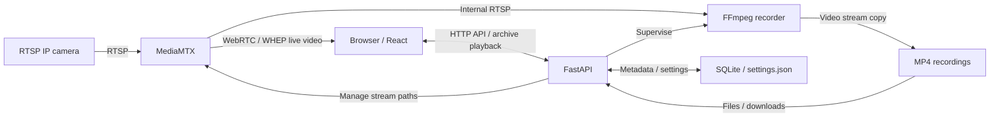

# TupoNVR

**Намеренно простой self-hosted NVR для RTSP-камер.**

[English version](README.md) · [Руководство по эксплуатации (на английском)](docs/operations.md)

[](LICENSE)
[](docker-compose.yml)

Добавьте камеры. Смотрите прямой эфир. Записывайте видео. Просматривайте архив. Ничего лишнего.

TupoNVR упрощает запись с IP-камер дома, в небольшой системе CCTV или домашней лаборатории (homelab). Простота — осознанное решение, а не временное ограничение.


*Настоящий скриншот приложения из браузерных тестов с синтетическим видео. См. [Скриншоты и демо](#скриншоты-и-демо).*

## Зачем TupoNVR?

Иногда нужен просто NVR, который записывает камеры и позволяет найти нужный момент. TupoNVR следует философии Unix и принципу KISS: узкая задача, проверенные инструменты и небольшая система, которую можно понять и обслуживать самостоятельно.

Один контейнер приложения и один контейнер MediaMTX обеспечивают запись, прямой эфир и просмотр архива. Запись продолжается даже после закрытия всех вкладок браузера. Видео копируется без перекодирования на сервере.

## Возможности

- Добавление, редактирование, включение, отключение и проверка RTSP-камер; отдельные показатели доступности и состояния записи.
- Прямой эфир (live view) отдельных камер и сохранённый мультиэкран с перемещением и изменением размеров плиток, включая дополнительные потоки камер.
- Запись исходного видео в MP4-сегменты, настройка срока хранения и скачивание.
- Просмотр одной или нескольких камер на общей шкале архива: воспроизведение, пауза, поиск по времени, выбор скорости, пробелы и независимые переходы между сегментами.
- Недельные расписания записи и единый часовой пояс установки, включая выбор времени в архиве с учётом переходов на летнее и зимнее время.
- Проверка каждого каталога назначения и необязательная защита по идентификатору от пропавших внешних хранилищ.
- Английский и русский интерфейс, необязательный вход в UI/API, универсальные webhook-уведомления, endpoints состояния и метрик.

## Быстрый старт

Нужен Linux-хост с **Docker Engine и Docker Compose v2**, доступом к камерам по сети и доступным для записи хранилищем, рассчитанным на их битрейт. Python, Node и FFmpeg на хосте не нужны. Для просмотра требуется современный браузер с WebRTC и поддержкой нужного кодека в MP4; начните с H.264.

1. Получите файлы развёртывания и создайте конфигурацию:

   ```sh
   git clone https://github.com/vvbelousov/TupoNVR.git
   cd TupoNVR
   cp .env.example .env
   ```

2. Отредактируйте `.env`: для просмотра с другого устройства укажите LAN IP хоста в `WEBRTC_HOST`. Задайте путь к каталогу записей на хосте в `DEFAULT_RECORDING_PATH` или оставьте `./recordings` для локального хранения. Сначала смонтируйте внешнее хранилище. Для входа в приложение задайте одновременно `AUTH_USERNAME` и `AUTH_PASSWORD`; по умолчанию оба пусты.

3. Задайте образ в `.env`: выберите `0.1.0`, `latest` или другой опубликованный тег из [Docker Hub](https://hub.docker.com/r/vvbelousov/tuponvr/tags). Фиксированная версия обеспечивает предсказуемые обновления; `latest` следует за текущим стабильным релизом.

   ```dotenv
   NVR_IMAGE=vvbelousov/tuponvr:0.1.0
   ```

   Загрузите и запустите контейнеры:

   ```sh
   docker compose up -d --no-build --pull always
   ```

4. Откройте `http://<host-address>:8080`, перейдите в **Камеры** и добавьте основной RTSP URL камеры и учётные данные. Камера и запись включены по умолчанию; запись начинается, когда хранилище готово. Нажмите **Проверить**, затем убедитесь в наличии прогресса записи в **Обзоре**. Перед использованием расписаний и местного времени архива настройте часовой пояс в **Аккаунт → Предпочтения**.

По умолчанию приложение доступно только на localhost. Для локальной сети задайте `NVR_BIND=0.0.0.0`, LAN IP хоста в `WEBRTC_HOST` и обе переменные аутентификации. Разрешите **TCP 8080 и UDP 8189**. Вход защищает API, архив и просмотр видео. TCP-порты MediaMTX должны оставаться закрытыми. См. [SECURITY.md](SECURITY.md) и [миграцию](docs/security-hardening.md).

Команда загружает выбранный образ без локальной сборки. Другие варианты описаны в [разделе о запуске образов и сборке из исходников](docs/operations.md#published-image-deployment).

## Скриншоты и демо

[Скриншот архива выше](docs/images/archive-synchronized.png) показывает четыре выбранные камеры, общие часы воспроизведения и независимые проигрыватели; у четвёртой камеры нет записи в выбранный момент. Это демонстрация интерфейса, а не сетевой совместимости реальных камер. Публичного демо и других скриншотов в репозитории нет. Приложение можно проверить с синтетическими камерами по [инструкциям для участников](CONTRIBUTING.md#validation).

## Архитектура



FastAPI, файлы React, SQLite и один процесс FFmpeg на каждую записываемую камеру находятся в **контейнере приложения**; MediaMTX — **второй сервис**. MediaMTX использует общее подключение к основному RTSP-потоку для записи и зрителей. Дополнительные потоки работают через отдельные пути по запросу. Прямая проверка доступности кратковременно открывает дополнительную RTSP-сессию к камере.

Запускайте ровно один worker приложения, чтобы избежать дублирующих процессов записи. См. [ответственность компонентов](docs/architecture.md) и [устройство записи](docs/operations.md#video-architecture).

## Конфигурация и хранение

Скопируйте [.env.example](.env.example) в `.env`; в нём перечислены все настройки Compose. При использовании опубликованного образа применяйте изменения окружения командой `docker compose up -d --no-build --pull always`.

| Переменная | Значение в `.env.example` | Назначение |
|---|---|---|
| `NVR_PORT` | `8080` | TCP-порт приложения на хосте |
| `NVR_BIND` | `127.0.0.1` | Адрес приложения; `0.0.0.0` для LAN |
| `WEBRTC_UDP_PORT` | `8189` | UDP-порт медиаданных WebRTC |
| `WEBRTC_HOST` | `127.0.0.1` | Адрес хоста, передаваемый браузерам для ICE |
| `DATA_DIR` | `./data` | Каталог хоста, подключённый к `/data`: SQLite и настройка часового пояса |
| `DEFAULT_RECORDING_PATH` | `./recordings` | Каталог хоста, подключённый к `/recordings` |
| `SEGMENT_SECONDS` | `600` | Целевая длина сегмента в секундах; границы зависят от ключевых кадров |
| `MIN_FREE_SPACE_GB` | `5` | Резерв свободного места (GiB) на файловых системах записей |
| `AUTH_USERNAME`, `AUTH_PASSWORD` | пусто | Необязательный общий вход; задайте оба значения или ни одного |
| `COOKIE_SECURE` | `false` | Secure cookie сессии для HTTPS |
| `DEFAULT_LANGUAGE` | `en` | Начальный язык интерфейса: `en` или `ru` |
| `APP_TIMEZONE` | `UTC` | Начальный часовой пояс установки; сохранённое в UI значение приоритетнее |
| `LOG_LEVEL` | `INFO` | Уровень логирования backend |
| `NVR_UID`, `NVR_GID` | `0`, `0` | Пользователь контейнера приложения; для non-root нужны права записи в каталоги хоста |
| `NVR_IMAGE` | `vvbelousov/tuponvr:0.1.0` | Ссылка на опубликованный образ приложения; пустое значение использует `tuponvr:local` |
| `WEBHOOK_URL`, `WEBHOOK_TOKEN` | пусто | Необязательные HTTP(S) endpoint и Bearer token |
| `WEBHOOK_DEBOUNCE_SECONDS` | `60` | Длительность непрерывной неисправности до уведомления |
| `WEBHOOK_COOLDOWN_SECONDS` | `600` | Минимальный интервал между уведомлениями о новых инцидентах одного объекта |

Записи содержат **только видео**, которое копируется в MP4-сегменты примерно по десять минут. Имена файлов и метаданные остаются в UTC; интерфейс и расписания используют часовой пояс установки. Архив показывает завершённые сегменты после индексирования, обычно при проверке раз в пять минут, а также после штатной остановки записи.

Каждая камера пишет в подкаталог назначения, например `default`. Срок хранения по умолчанию — **7 дней**, допустимы 1–3650 дней; пустое значение снимает ограничение по возрасту. Для записей удалённой камеры действует семидневный предел от начала записи, а не от даты удаления камеры. При нехватке места очистка удаляет старейшие доступные индексированные файлы, защищая текущий час активных камер. Резерв места не всегда гарантирован; отсутствие ограничения по возрасту не отменяет удаление при нехватке места.

Монтируйте NFS/SMB на хосте и проверяйте права записи и видимость ресурса внутри контейнера. Перед записью на внешнее хранилище включите защиту каталога назначения по идентификатору. Недоступность хранилища приостанавливает запись его камер; другие каталоги назначения и прямой эфир продолжают работать. См. [защиту хранилищ](docs/operations.md#per-destination-storage-protection).

Перед обновлением сохраняйте и резервируйте полный каталог данных, записи, `.env` и ID хранилищ. Учётные данные камер хранятся в SQLite открытым текстом: защищайте данные и резервные копии. См. [обновление и восстановление](docs/operations.md#updating-backup-and-recovery), [права контейнера](docs/operations.md#container-permissions) и [настройку HTTPS/прокси](docs/operations.md#configuration).

## Философия проекта

Простота — это предсказуемое поведение, видимые ошибки и система, которую можно обслуживать самостоятельно. TupoNVR использует проверенные компоненты для передачи, записи и хранения видео, ограничивает число зависимостей и сервисов и стремится хорошо решать одну задачу: давать доступ к видео камер для просмотра и разбора событий. Новые возможности должны улучшать этот процесс без лишней инфраструктуры.

## Что не входит в цели проекта

TupoNVR не стремится стать корпоративной системой управления видео (VMS) с распределённой инфраструктурой, сложными организационными политиками доступа или большой платформой автоматизации видеонаблюдения. Практические улучшения записи, прямого эфира, архива и надёжности соответствуют проекту; усложнение ради самого усложнения — нет.

## Известные ограничения

- Не реализованы аудиозапись, детекция, PTZ, обнаружение и управление через ONVIF, управление несколькими пользователями и нативное мобильное приложение.
- Перекодирования нет: просмотр прямого эфира и архива зависит от поддержки кодека браузером. Поддержка H.265 различается; статус Online не гарантирует воспроизведение в браузере.
- Синхронизация архива практическая, без покадровой точности. Точность меток времени, задержки камер, пропускная способность сети и возможности декодера браузера ограничивают точность и число камер; заявленных тестов производительности нет.
- Внезапное отключение питания может оставить незавершённые MP4. Автоматического ремонта и резервного копирования нет; индексатор может удалить файлы без MP4 `moov` atom через 24 часа.
- TCP-порты MediaMTX должны оставаться закрытыми. Вход защищает сигнализацию через приложение; вне доверенной LAN используйте HTTPS и Secure cookies.
- Монтирование и восстановление NAS — задачи хоста; проверки хранилищ не исправляют зависший ввод-вывод ядра и не гарантируют сохранность текущего сегмента при потере ресурса.
- В описанной подготовке релиза остаются непроверенными нативный запуск на ARM и длительная работа с реальными камерами/NAS. ARM CI настроен; перед заявлением о поддержке проверьте целевое оборудование.

Диагностика описана в [руководстве по эксплуатации](docs/operations.md), ограничения воспроизведения и API — в [модели времени и архива](docs/time-and-archive.md).

## Совместимость камер

В репозитории есть интеграционные тесты с синтетическим H.264 RTSP-источником, но нет проверенного списка совместимых марок и моделей. Нужен рабочий RTSP-источник; автоматического обнаружения через ONVIF нет. Камеры с жёстким лимитом подключений могут отклонять дополнительную диагностическую сессию.

Отправляйте отчёты о совместимости через [Issues](https://github.com/vvbelousov/TupoNVR/issues): модель камеры, прошивка, кодек, разрешение, поведение основного и дополнительного потоков, браузер и результаты прямого эфира, записи и просмотра архива. Удаляйте учётные данные, приватные URL и видео из отчётов.

## Участие и обратная связь

Приветствуются [Issues](https://github.com/vvbelousov/TupoNVR/issues) и [pull requests](https://github.com/vvbelousov/TupoNVR/pulls): сообщения об ошибках, проверка совместимости, точечные исправления, переводы и документация. Сначала обсуждайте существенные новые возможности, чтобы система оставалась простой.

Разработка и `scripts/validate.sh` описаны в [CONTRIBUTING.md](CONTRIBUTING.md), покрытие тестами — в [руководстве по эксплуатации](docs/operations.md#development-and-validation), изменения релизов — в [CHANGELOG.md](CHANGELOG.md), подготовка публикации — в [руководстве сопровождающего](docs/releasing.md). Об уязвимостях сообщайте по приватному каналу из [SECURITY.md](SECURITY.md).

## Лицензия

TupoNVR использует [Apache-2.0](LICENSE). Зависимости сохраняют собственные лицензии; см. [уведомления о стороннем ПО](docs/third-party.md) и [лицензию MIT](frontend/public/MEDIAMTX-LICENSE.txt) включённого reader MediaMTX.
